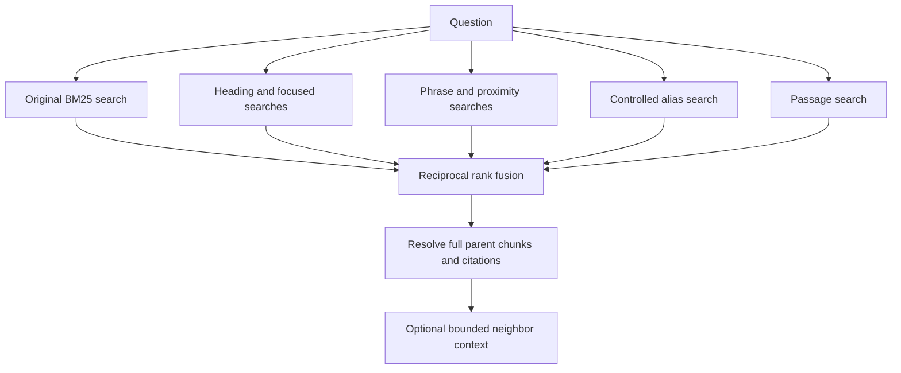

# Retrieval

**Status:** Implemented baseline and lexical-refinement experiment. Clinical accuracy gains remain unverified.

## At a glance

- **Purpose:** Find source evidence relevant to a question.
- **Input:** Question and a verified chunk bundle.
- **Output:** Ranked chunks, source passages, citations and optional neighboring context.
- **Next:** Context preparation.


## Technical working: scoring and fusion

Implementation: [retrieval.py](../../src/mobile_rag/retrieval.py) and [retrieval_enhanced.py](../../src/mobile_rag/retrieval_enhanced.py).

1. Verify artifact hashes, IDs, relationships and stored source mappings when building/opening the index.
2. Tokenize the question with SQLite `unicode61`; collect distinct terms in first-occurrence order. Quote each term before composing MATCH expressions and bind values through SQL parameters.
3. Baseline search uses OR (or explicitly requested AND) with equal heading/body weights. Lower raw SQLite BM25 scores rank first; ties use chunk ID.
4. Enhanced OR search adds heading weight 3/body weight 1, a focused query when filler is removed, phrase/NEAR branches for 2?8 focused terms and corpus-defined CPAP expansion. Explicit AND uses the baseline behavior.
5. Each chunk branch takes at most 40 candidates. Passage search examines at most 160 units and contributes at most 40 distinct parent chunks. It keeps whole tables, not individual table rows.
6. Merge ranks with `RRF(chunk) = sum(1 / (60 + branch_rank))`. Higher fused scores rank first. A parent votes once in each branch; ties use chunk ID.
7. Resolve selected IDs back to full source chunks and citations. Optional expansion considers neighbors of the first three hits, requires the same document/heading context, deduplicates IDs and applies its character budget.

### Example: query branches

```text
Question: What should I remember about bubble CPAP?
Focused terms: bubble, cpap
Focused MATCH: "bubble" OR "cpap"
Phrase MATCH: "bubble cpap"
Proximity MATCH: NEAR("bubble" "cpap", 8)
Alias branch adds: "continuous positive airway pressure"
```

The original query remains a branch. Focused terms retain negation and numbers, but OR matching does not enforce those as clinical constraints. Phrase matching uses the distinct token sequence, not an exact reconstruction of the original sentence.

### Example: fusion arithmetic

| Chunk | Branch A rank | Branch B rank | RRF score |
| --- | ---: | ---: | ---: |
| X | 1 | 3 | `1/61 + 1/63 = 0.03227` |
| Y | 2 | Absent | `1/62 = 0.01613` |

X wins this illustrative ranking; the score is not a probability of correctness. Passage document filtering currently occurs after the bounded candidate query, which can reduce available candidates for a restricted document.


## Search flow



## Search options

| Mechanism | Purpose | Limitation |
| --- | --- | --- |
| Original BM25 | Preserve a comparison baseline. | Misses some paraphrases. |
| Heading weights | Favor useful section matches. | Weighting can change ranking without improving accuracy. |
| Focused query | Remove limited conversational filler. | Does not interpret clinical constraints. |
| Phrase / proximity | Reward terms occurring together. | Not semantic understanding. |
| Controlled aliases | Expand corpus-defined CPAP terminology. | No broad medical synonym dictionary. |
| Passage search | Match smaller units and return whole parent chunks. | Adds storage and query cost. |
| Rank fusion | Combine branch rankings. | Scores are not confidence probabilities. |

## Mobile considerations

- Uses local SQLite FTS5; no embedding model or neural reranker.
- Candidate pools and neighbor expansion are bounded.
- Keep the baseline for comparisons: extra branches cost time and storage.
- Desktop measurements do not establish performance on a phone.

## Open the implementation

- [Single retrieval notebook](../../notebooks/retrieval/03_retrieval.ipynb)
- [Run guide](../../notebooks/retrieval/README.md)
- [Baseline build evidence](../modeling/06-build-review.md)
- [Refinement details and measurements](../modeling/07-enhanced-retrieval.md)

Continue to [Context preparation](05-context-preparation.md).
