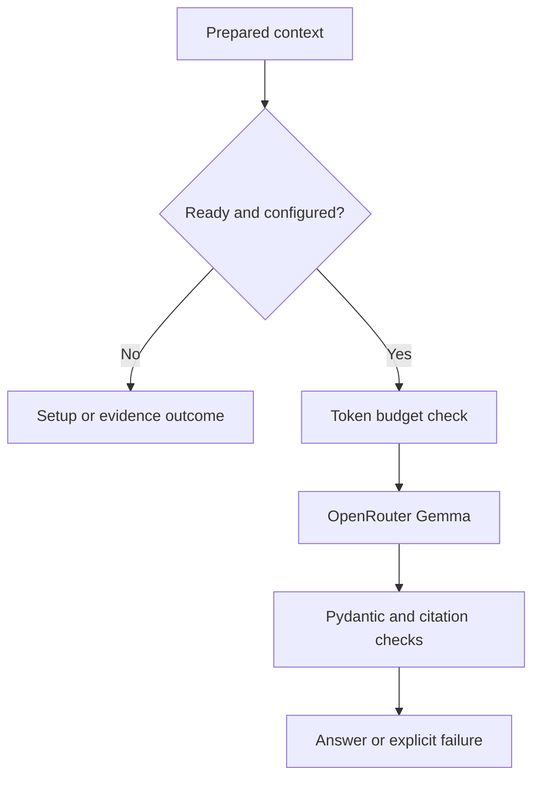

# Answer generation

[Reading order](README.md)

## At a glance

- Input: question and prepared evidence.
- LLM output: categorical status, answer text, evidence-based reason and citation labels.
- Pydantic checks structure and citation membership; it does not prove medical correctness.
- Local integration is implemented; live model and tokenizer verification remain pending.


## Technical working: request to validated answer

Implementation: [answer_generation.py](../../src/mobile_rag/answer_generation.py) and [answer_schema.py](../../src/mobile_rag/answer_schema.py).

1. `make_request()` checks context consistency and builds one user message containing instructions and encoded evidence.
2. `answer_json_schema()` generates the Pydantic JSON Schema and adds the current citation-label enum.
3. `GemmaTokenCounter.count()` applies the local tokenizer chat template and generation prefix. It requires local tokenizer/config/template files; no weights are loaded.
4. `generate_answer()` blocks if local prompt tokens + output reserve + formatting margin exceed the configured total. Without a tokenizer, return `tokenizer_required`; with `live=False`, a configured request returns `dry_run`.
5. Live execution requires the API key, sends one non-streaming request and measures elapsed request time. No automatic retry or alternate model is used.
6. Check returned model and normal completion. Parse through `GroundedAnswer.model_validate_json(..., context={"citation_map": ...})`; return its dictionary only after validation.

### Example: token gate

```text
Local prompt count:  31,500
Output reserve:      1,024
Formatting margin:     512
Total:              33,036 > configured 32,768
Outcome: budget_blocked; no model request
```

The numbers are illustrative. Local template counting does not prove provider-template parity; schema processing can add upstream overhead.

### Example: validation rules

| Model output | Result |
| --- | --- |
| Nonblank answer/reason, status answered, citations all supplied | Structurally accepted |
| Valid JSON citing S99 when only S1 exists | Rejected as invalid response |
| Answered with an empty reason | Rejected by Pydantic |
| Insufficient evidence with empty answer/citations and nonblank reason | Valid abstention |
| Completion ends because of output length | Incomplete response, not an accepted answer |

A valid evidence-based-looking reason can still be unsupported. These rules validate structure and references; semantic evaluation remains separate.


## Function flow



Status: implemented locally; hosted verification pending credentials and tokenizer access.

This function follows context preparation and sends one evidence-only question to `google/gemma-3-4b-it` through OpenRouter. See the [notebook](../../notebooks/answer_generation/05_answer_generation.ipynb) and [runner guide](../../notebooks/answer_generation/README.md).

## Implemented behavior

- The answer contract is defined in `src/mobile_rag/answer_schema.py` using Pydantic v2: `AnswerClaim` and `GroundedAnswer`.
- OpenRouter receives JSON Schema generated from these models, with citation enums restricted to the current context.
- Local `model_validate_json` validation enforces strict types, forbids extra fields, checks citation membership, and enforces answered/abstention consistency.
- Cross-field validators are local checks; they are not automatically represented in JSON Schema.
- The existing dictionary result format is retained through `model_dump()`.

- Build fresh context from the verified retrieval index. Validate package labels, rendered text, source references and citation mappings. Package consistency validation alone is not source authentication; the normal runner establishes provenance upstream.
- Send a single user turn containing instructions and encoded question/evidence data. No benchmark answers or external knowledge tools are supplied.
- Require JSON with `status`, `claims` and `reason`. Every answered claim requires nonempty text and supplied citation labels. Abstention contains no claims and a reason. Temperature zero is not a determinism guarantee.
- Pin DeepInfra with fallback disabled and require parameter support. Apply an output cap, local token preflight and timeout. Unsupported requests fail without weakening the schema.
- Reject unknown citations, malformed JSON, unexpected models and non-normal completion endings, including truncation. Citation identity is checked; semantic support and clinical correctness are not automatically verified.
- Record prompt version, request fingerprint, configuration, source identity, accepted output, returned model/provider, usage and elapsed request time. Credentials and raw failed response bodies are omitted. API failures remain distinct from insufficient evidence. No automatic retries.

## Answer schema

### What the LLM generates and what the application adds

The LLM generates only the answer object below. Pydantic defines its shape and validates the returned JSON; it does not generate the answer text.


| Field                                                  | Produced by                  | Meaning                                                                                      |
| ------------------------------------------------------ | ---------------------------- | -------------------------------------------------------------------------------------------- |
| `status` inside the answer                             | LLM                          | Chooses `answered` or `insufficient_evidence` based on the supplied evidence.                |
| `claims[].text`                                        | LLM                          | Writes each answer statement from the supplied evidence.                                     |
| `claims[].citations`                                   | LLM                          | Selects existing labels such as `S1`; it does not create source IDs.                         |
| `reason` inside the answer                             | LLM                          | Explains insufficient evidence; must be empty when answered.                                 |
| Evidence text and citation labels                      | Context preparation          | Supplies source passages and assigns labels before generation.                               |
| `citation_map`                                         | Application                  | Resolves labels to stored documents, chunks and passages.                                    |
| Validation outcome and outer result `status`           | Application                  | Reports accepted output, setup requirements, budget blocks, API errors or invalid responses. |
| Request fingerprint, configuration and source identity | Application                  | Records how the request was constructed and which evidence was used.                         |
| `latency_ms`                                           | Application                  | Measures elapsed request time.                                                               |
| `usage`, response ID and returned provider/model       | OpenRouter response metadata | Reports service metadata; these are not generated answer claims.                             |


The application accepts the generated answer only after schema and citation-label validation. It cannot establish clinical correctness merely by checking those fields. Empty or budget-blocked context can also produce an application-side `insufficient_evidence` result without calling the LLM; its reason identifies the context condition.

### What has been produced now

- The current saved runs contain retrieved evidence, prepared context, a request preview and an application result indicating `tokenizer_required`.
- They contain **no live LLM-generated answer**: `answer` is `null` and `live_request_sent` is `false`.
- The JSON responses shown below are authored documentation examples, not Gemma outputs.
- Test responses are synthetic fixtures used to exercise validation.

Once the tokenizer and API key are configured and a live run succeeds, `result.json` will contain the validated LLM response under `answer`, alongside application diagnostics and provider metadata.

The following shows the field definitions from [answer_schema.py](../../src/mobile_rag/answer_schema.py). The implementation also contains the validators described below.

```python
from typing import Literal
from pydantic import BaseModel, ConfigDict, Field


class AnswerClaim(BaseModel):
    model_config = ConfigDict(strict=True, extra="forbid")

    text: str = Field(min_length=1)
    citations: list[str] = Field(min_length=1)


class GroundedAnswer(BaseModel):
    model_config = ConfigDict(strict=True, extra="forbid")

    status: Literal["answered", "insufficient_evidence"]
    claims: list[AnswerClaim]
    reason: str
```

All fields are required. Extra fields and incorrect types are rejected without coercion. Claim text and citation labels must not be whitespace-only. During response validation, every citation must exist in the current context's citation map.


| Status                  | Claims                                                   | Reason                              |
| ----------------------- | -------------------------------------------------------- | ----------------------------------- |
| `answered`              | At least one claim; each has at least one valid citation | Must be the empty string            |
| `insufficient_evidence` | Must be an empty list                                    | Must contain a nonblank explanation |


### Example: answered

This is an illustrative schema example, not a live model response or clinical recommendation. Assume the supplied evidence labeled `S1` explicitly defines CPAP as continuous positive airway pressure.

```json
{
  "status": "answered",
  "claims": [
    {
      "text": "CPAP stands for continuous positive airway pressure.",
      "citations": ["S1"]
    }
  ],
  "reason": ""
}
```

`S1` resolves through the prepared context's citation map to the original document, chunk and passages. A valid label alone does not prove that its source supports the claim.

### Example: insufficient evidence

```json
{
  "status": "insufficient_evidence",
  "claims": [],
  "reason": "The supplied evidence does not specify the requested dosage for this age group."
}
```

This illustrative response makes no dosage claim. Abstention requires an empty claims list even if a partial answer might otherwise be generated.

### Schema generation and local validation

```python
import json
from mobile_rag.answer_schema import GroundedAnswer, answer_json_schema

# In the pipeline, use the real citation map from context preparation.
citation_map = {"S1": {}}  # Membership-only placeholder for this example.
schema = answer_json_schema(list(citation_map))

response_format = {
    "type": "json_schema",
    "json_schema": {
        "name": "grounded_answer",
        "strict": True,
        "schema": schema,
    },
}

content = json.dumps({
    "status": "answered",
    "claims": [{
        "text": "CPAP stands for continuous positive airway pressure.",
        "citations": ["S1"],
    }],
    "reason": "",
})
answer = GroundedAnswer.model_validate_json(
    content, context={"citation_map": citation_map}
)
validated_payload = answer.model_dump()
```

- The generated schema restricts citation strings to the supplied labels.
- Local Pydantic validators additionally enforce cross-field rules and nonblank text.
- For example, an answer citing `S99` when only `S1` is available is rejected; so is `answered` with no claims.
- The existing `validate_answer(content, citation_map)` wrapper performs this validation and returns the dictionary payload.
- Validation errors in the generation pipeline produce `invalid_response` rather than an accepted answer.

## Token budget and limitation

- The optional `generation` dependencies load a local Gemma tokenizer with network downloads and remote code disabled.
- Tokenizer/config/template hashes are recorded.
- The complete user message is counted with the local chat template and generation prefix.
- Defaults: 32,768 total, 1,024 completion and 512 for upstream formatting differences.
- Oversized prompts are blocked for explicit repacking; no evidence is silently truncated.

- **Exact local template counts are not exact OpenRouter counts.** Provider message transformations and schema processing may differ.
- The reserve is experimental, not a verified upper bound.
- Provider prompt usage is compared with local counts when available.
- The earlier promise of exact upstream accounting remains unfulfilled until tokenizer access and live provider calibration are available.

On 2026-09-13, no `OPENROUTER_API_KEY` or `.env` was configured. Unauthenticated requests for Google's official tokenizer files returned HTTP 401. No license terms were accepted automatically and no replacement tokenizer was substituted. Live inference and real-tokenizer validation remain pending.

## Outcomes

Statuses: `answered`, `insufficient_evidence`, `invalid_context`, `tokenizer_required`, `credentials_required`, `budget_blocked`, `dry_run`, `api_error`, `incomplete_response`, `invalid_response`. Accepted structure still requires semantic evaluation.

Empty or budget-blocked context produces local insufficient evidence with an explicit reason and no request. Invalid context is rejected. With ready but inadequate evidence, abstention is prompted; its reliability must be measured on the supplied Q&A.

## Verification and follow-up

Pydantic integration verification: 23 project tests passed, Ruff passed, and the answer-generation notebook was re-executed offline. Additional cases cover strict types, extra fields, blank claims/reasons, citation scope and schema generation. Hosted schema acceptance remains unverified.

- Verification recorded 2026-09-13: all 13 project tests passed and Ruff passed.
- The notebook executed four code cells in a fresh kernel with no cell errors. [Saved result](../../artifacts/answer-generation/20260913T101127326269Z/result.json) records `tokenizer_required` and `live_request_sent=false`; the same run includes the real corpus context and request preview.
- No hosted answer or benchmark score was produced.
- Tests use an explicitly synthetic token counter and injected response transport; the official tokenizer and hosted API path remain unverified.

- Offline tests cover request settings, synthetic token-budget gates, package consistency, answer/abstention parsing, missing/unknown citations, truncation, model mismatch, malformed responses and redacted HTTP failures without retries.
- They do not establish clinical accuracy or live provider behavior.

After hosted verification, the next function is answer evaluation using existing Q_S1/Q_S2: answer support, citation relevance, abstention and failures. Skipped OCR and benchmark-preparation work remains skipped.

## Integration references

- The [model page](https://openrouter.ai/google/gemma-3-4b-it) and [endpoint metadata](https://openrouter.ai/api/v1/models/google/gemma-3-4b-it/endpoints), inspected 2026-09-13, listed DeepInfra, a 131,072-token context and structured-output support.
- Availability can change; the smaller local budget is an experiment setting.

- Request fields follow the [OpenRouter API reference](https://openrouter.ai/docs/api/reference/overview) and [structured-output guide](https://openrouter.ai/docs/guides/features/structured-outputs).
- Tokenizer access follows the [official Google repository](https://huggingface.co/google/gemma-3-4b-it).
- No prices are hard-coded; API usage/cost fields are retained when returned.
