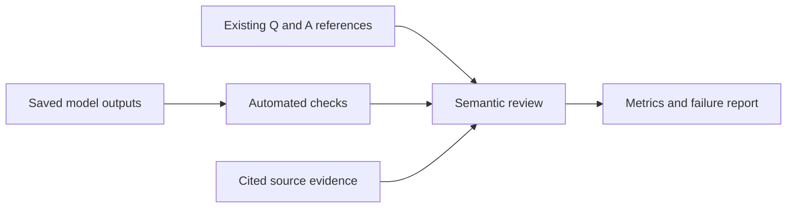

# Answer evaluation

[Reading order](README.md)

## At a glance

- Documentation only; no evaluation implementation yet.
- Use existing Q_S1/Q_S2: 200 questions, including 30 marked unanswerable.
- Measure answer correctness, answer/reason support, citation relevance and abstention separately.
- Keep setup/API failures visible; they are not correct abstentions.
- References enter evaluation only, never retrieval or generation prompts.

## Technical design: joining records and calculating metrics

**Planned, not implemented.** No evaluation functions or scored results are implied by this section.

- Join questions to generation records by dataset plus question ID, not numeric ID alone.
- Preserve attempt ID and configuration hashes so retries and changed prompts do not overwrite a comparison.
- Map expected answerability from declared benchmark markers; inspect outer application status separately from inner model status.
- Run schema/reference checks first. Human review fields remain null until reviewed.
- Aggregate numerator, denominator and exclusions together; a zero denominator produces null.

### Example: failures must not count as good abstention

Assume 10 expected-unanswerable questions produce:

| Outcome | Count |
| --- | ---: |
| Model abstention | 6 |
| Local context abstention | 1 |
| Answered incorrectly | 1 |
| API failure | 2 |

- Explicit insufficient-evidence handling: `(6 + 1) / 10 = 70%`, with the two kinds shown separately.
- False-answer rate: `1 / 10 = 10%`.
- API failure rate: `2 / 10 = 20%`; these failures are not successful abstentions.
- These are invented arithmetic examples, not model measurements.

For token-overlap diagnostics, compute multiset overlap, precision and recall, then `F1 = 2PR/(P+R)` when defined. For reference tokens `[a,a,b]` and prediction `[a,b,b]`, overlap is 2, precision and recall are both 2/3, and F1 is 2/3. This lexical score is not a clinical correctness score.

## Function flow

Status: documentation only. No evaluation code, notebook or model requests are authorized by this document.

## Purpose

Measure whether generated answers agree with the existing benchmark, whether supplied evidence supports both the answer and its explanation, and whether the system abstains appropriately. Report operational failures and resource cost alongside answer quality.

Pipeline: **Retrieval → Context preparation → Answer generation → Answer evaluation**.

- Use the existing Q_S1/Q_S2 as the accepted working benchmark.
- Do not introduce a new OCR audit, benchmark-correction phase, annotation prerequisite or train/test split.
- Reviewing generated outputs is part of evaluation, not a revalidation of the reference answers.
- Results describe agreement with this corpus and benchmark; they do not establish independent clinical validity or held-out generalization.

## Inputs and separation from generation

| Input | Use |
| --- | --- |
| `data/questions/Q_S1.json` and `Q_S2.json` | 100 questions each, with reference answers, category, topic and source-of-truth descriptions. |
| Generation result | Outer application status and inner `answer` object containing `status`, `answer`, `reason`, `citations`. |
| Retrieval and prepared context | Determine what evidence was found, what was included, and what was excluded. |
| Citation map and stored source passages | Resolve labels and inspect support without inventing source coordinates. |
| Configuration, hashes and usage | Reproduce comparisons and measure runtime/token cost. |

Use composite question IDs such as `Q_S1:1` and `Q_S2:1`; numeric IDs overlap between files. Do not deduplicate question variants silently. Group summaries by dataset, category and topic so repeated topics do not look like independent evidence of broad coverage.

Only question text goes through retrieval and generation. Reference answers and source-of-truth descriptions enter the evaluation process after an output has been produced. Do not use expected sources as retrieval filters or reference answers as prompt context.

- Neither question file has a dedicated answerability field in its current row schema.
- Q_S2 metadata explicitly marks unanswerable rows using category `Unanswerable` and source `Not in corpus.`; both markers agree on 30 current rows.
- Q_S1 has no such rows.
- Use those markers for expected-unanswerable cases; treat the remaining source-backed reference answers as expected answerable under the accepted benchmark assumption (Q_S1: 100; Q_S2: 70).
- Record the mapping rule and recompute counts from the frozen files.
- Marker disagreements or missing references become `unknown`.
- Do not infer answerability from whether our system answered.

## Evaluation workflow

1. **Freeze the run.** Record benchmark file hashes, retrieval/index identities, context settings, prompt version, Pydantic schema, tokenizer hashes, requested/returned model and provider. Use the current flat answer format; reject or explicitly label historical claims-format records.
2. **Verify a small live sample.** Before a full batch, confirm generation works with the configured key and tokenizer and that requests, source labels, token accounting and usage are captured. Current earlier runs were setup-only, not live answers.
3. **Run or import outputs.** Support evaluation of saved genuine outputs without another model call. When batch generation is authorized, process the two datasets with explicit question and spend/request limits. Save each completed question so interruption does not require repeating successful calls. Record retries as distinct attempts, never cherry-pick the best output.
4. **Apply automated checks.** Validate the output schema, resolve citation labels, measure overlap diagnostics and aggregate statuses, latency and usage. Keep failed and unattempted questions visible.
5. **Review semantic quality.** Present question, reference, generated answer, generated reason and cited evidence together. Record answer correctness and evidence support independently. Unreviewed fields remain null, not automatic passes.
6. **Summarize failures and comparisons.** Save per-question records and a readable report, including denominators, review coverage, critical errors, category breakdowns and resource cost.

- The proposed first comparison uses the existing retrieval configuration.
- Any later baseline/enhanced or prompt comparison must use the same question set and frozen settings for the other components.
- Label results used for tuning as development results.
- No independent test-performance claim is made from the same exposed questions.

## Quality checks

| Dimension | Automated check | Semantic review |
| --- | --- | --- |
| Output validity | Pydantic types, required fields, status consistency and nonblank reason | Whether the format hides an incomplete answer |
| Reference agreement | Normalized exact match and token-overlap F1 as diagnostics only | Correct, partially correct, incorrect, or unreviewed |
| Answer support | Citation labels resolve to included evidence | Whether every material statement follows from the cited passages |
| Reason support | Reason exists and cited labels are valid | Whether it explains the answer using evidence without invented justification |
| Citation relevance | IDs, document links and included passage membership | Whether the cited sources actually support the answer and explanation |
| Completeness | No reliable automatic completeness claim | Missing actions, conditions, exceptions or other required reference content |
| Numerical fidelity | Surface differences may be flagged | Dosages, units, ages, thresholds, routes, frequency and negation in context |
| Abstention | Expected answerability versus actual outcome | Whether support was insufficient, conflicting or overlooked |

A citation is valid structurally without necessarily being relevant. A correct-looking answer may still be unsupported by retrieved evidence. A supported answer can still disagree with the reference. Preserve these distinctions in the report.

The `reason` is a concise evidence-based justification, not a request for internal chain-of-thought. Review its factual support, consistency with the answer and relevance to the question.

- String overlap must never be reported as clinical accuracy.
- For reproducibility, proposed overlap normalization uses Unicode NFC, lowercase and whitespace-delimited tokens, retaining numbers and punctuation.
- Exact match compares the normalized strings; token F1 uses multiset overlap.
- Score only nonempty answered outputs and show eligible counts.
- Equivalent wording can score poorly; numerically dangerous answers can score highly.

An LLM judge is deferred from the initial implementation. It would add another model dependency, cost and possible bias. If later authorized, record its model/prompt and calibrate its judgments against human review; never treat self-grading by the generator as ground truth.

## Metrics and denominators

Report counts together with every rate. Let `N` be selected questions, `V` structurally valid model responses, `A` accepted answered responses, `U` explicitly expected-unanswerable questions, and `K` explicitly expected-answerable questions.

- **Execution coverage:** attempted generation requests / N; separately count reused saved outputs, local no-call outcomes and unattempted questions.
- **Response validity:** V / completed provider responses; also report V / N to expose request/setup failures.
- **Answer coverage:** A / N. This measures how often the system supplies an answer, not correctness.
- **Reviewed correctness:** fully correct answers / semantically reviewed answered outputs. Show partial, incorrect and unreviewed counts; show a conservative end-to-end count of reviewed-correct answers / N without claiming unreviewed answers are known wrong.
- **Answer support and reason support:** fully supported outputs / reviewed answered outputs, separately for each field. Partial or unsupported cases are reported separately.
- **Citation relevance:** supporting citation-label uses / reviewed citation-label uses. Since citations attach to the whole answer, also assess whether their combined evidence covers all material answer and reason content.
- **Unanswerable handling:** explicit insufficient-evidence outcomes on U / U. Split model abstentions from local context-related abstentions. API errors, setup blocks and unattempted cases do not count as correct abstentions.
- **False-answer rate:** answered outcomes on U / U. Report failures alongside this rate; a system with no successful requests must not appear safe simply because it answered nothing.
- **Unnecessary abstention:** explicit insufficient-evidence outcomes on K / K; distinguish retrieval/context shortages from model abstentions.

- If a denominator is zero, report null with its count, not 0% or 100%.
- Unknown expected-answerability cases are excluded only from answerability-specific rates and counted explicitly.
- These metrics are descriptive for the supplied benchmark; no fixed clinical acceptance percentage is established here.

## Operational outcomes and costs

- Distinguish `answered`, model `insufficient_evidence`, local context abstention, `invalid_context`, `tokenizer_required`, `credentials_required`, `budget_blocked`, `api_error`, `incomplete_response`, `invalid_response`, and `dry_run`.
- Inspect the outer result, inner answer status and request-sent flag together.
- A setup-only run cannot supply answer accuracy measurements.

- Record retrieval, context packing, provider request, validation and total elapsed time separately where instrumentation permits.
- Missing timings remain missing; do not derive total latency from provider time alone.
- Report median and p95 with sample sizes, cache/warm-up policy and environment.
- Desktop/API timing is not mobile on-device timing.

- Use provider-reported prompt/completion tokens and cost when returned.
- Compare local prompt-token counts with provider counts, but do not assume exact template parity.
- Missing cost is null, not free; any price-based estimate must record its dated price source and be labeled estimated.
- Include paid failed attempts when usage is available.
- Never log credentials.

## Per-question evaluation record

Proposed fields:

- Question identity, dataset, category, topic and benchmark hashes.
- Reference answer and source description, kept in evaluation artifacts only.
- Expected answerability plus mapping provenance.
- Generation/context artifact paths, run IDs, attempt number and configuration fingerprints.
- Outer application status, whether a request was sent, generated answer object and structural checks.
- Exact-match/token-F1 diagnostics, with nulls for ineligible outputs.
- Human review: correctness, completeness, answer support, reason support, citation relevance, severity, reviewer and notes. Default unreviewed.
- Failure tags, timings, usage, observed cost or explicit missing values.

- Failure tags can include `retrieval_miss`, `context_omitted`, `missing_qualifier`, `unsupported_answer`, `unsupported_reason`, `wrong_number_or_unit`, `citation_mismatch`, `false_answer_on_unanswerable`, `unnecessary_abstention`, `schema_failure`, and `provider_failure`.
- Multiple tags are permitted.
- Leave the cause undetermined when the evidence is insufficient to attribute it.

## Proposed files

| Location | Responsibility |
| --- | --- |
| `src/mobile_rag/answer_evaluation.py` | Join benchmark/results, compute diagnostics and aggregate reviewed outcomes. |
| `notebooks/answer_evaluation/answer_evaluation.ipynb` | Inspect outcomes, comparisons and error examples. |
| `notebooks/answer_evaluation/run_answer_evaluation.py` | Run evaluation of saved artifacts; batch generation only through explicit configuration. |
| `notebooks/answer_evaluation/README.md` | Run modes, inputs, review workflow and limitations. |
| `artifacts/answer-evaluation/<run>/` | Manifest, per-question JSONL, review CSV, metrics and report. |

These locations are planned only. No files at these locations are created by this documentation task.

## Completion and review criteria

- All selected questions are accounted for, including failures, missing outputs and unknown answerability.
- References never enter retrieval or generation inputs.
- Aggregation is reproducible from saved records; each metric has a denominator and review-coverage count.
- Synthetic/setup-only results cannot be labeled live model results or clinical accuracy evidence.
- Citation and context links resolve to the recorded artifacts; missing evidence is explicit.
- The notebook shows valid answers, inappropriate answers, abstentions and operational failures when present, without manufacturing examples as model outputs.
- Potentially harmful numerical/qualifier errors are surfaced individually rather than hidden by an average. An unresolved critical error prevents claiming readiness for the affected use case.
- Review the findings before choosing retrieval/prompt changes or moving toward mobile integration. A successful software evaluation run is distinct from acceptance of the model's answer quality.

Implementation can begin with deterministic scoring/reporting and fixture-based checks when authorized. A genuine answer-quality report requires live generated outputs, and semantic accuracy conclusions require completed output review. This document does not reopen the skipped preparation work.
