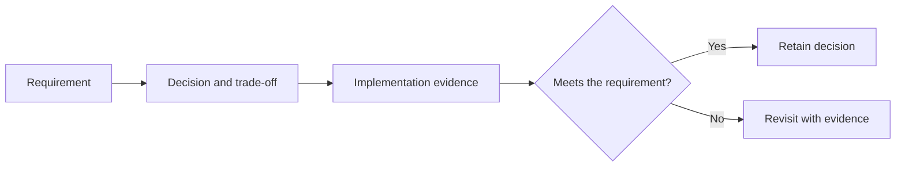

# Architecture decisions

[Reading order](README.md)

## At a glance

- Use local lexical retrieval first, without embeddings.
- Use OpenRouter Gemma for hosted experiments; offline deployment is separate.
- Resolve citations in application code.
- Keep abstention distinct from technical errors.
- Earlier gold-review and split proposals are deferred under the current scope.

## Technical traceability example

| Decision | Code or artifact evidence | Revisit condition |
| --- | --- | --- |
| Lexical retrieval before embeddings | SQLite index plus branch/fusion results | Persistent semantic misses justify a separately measured experiment |
| Application-resolved citations | Context citation map and Pydantic membership check | A new source/viewer format requires a compatible mapping |
| Separate failures from abstention | Outer generation status versus inner answer status | New transport or retry behavior needs explicit outcome accounting |

Example: changing the citation label format must update context rendering, generated schema enums, response validation and viewer resolution together. A decision is only implemented when these dependent contracts agree.

## Function flow

## How to read the detailed design

- The summary above and current function specifications describe the active scope.
- The detailed design below retains earlier proposals and rationale for traceability.
- Older OCR/gold-review/split requirements are deferred. Earlier claim-based output, retry settings and model budgets are superseded by [Answer generation](06-answer-generation.md).
- Original stage numbers do not change the purpose-based notebook layout.

Date: 2026-09-13. User-selected model and planning-only scope are fixed for this task. Other choices are proposed until validated in implementation.

## ADR-001: Hosted baseline followed by offline mobile validation

**Decision:** Use Python and `google/gemma-3-4b-it` through OpenRouter for experiments; retain fully local mobile inference as a later gate.

**Alternatives:** Begin with mobile integration immediately, or make cloud generation the final product architecture.

**Rationale:** The user explicitly selected OpenRouter for experimentation while existing requirements retain offline mobile use. Separating the stages lets retrieval and grounding be measured before runtime integration.

**Trade-off:** Hosted results cannot prove local speed, resource use, or quantized answer quality. Mitigate with a replaceable generator interface and identical evaluation inputs. Revisit the production model after measured mobile comparison; do not silently replace the hosted baseline.

## ADR-002: Local SQLite retrieval with optional dense search

- **Decision:** Establish FTS5 lexical retrieval first with no embedding model.
- Evaluate reviewed clinical aliases and context expansion before considering dense retrieval.
- A compact embedding model and exact vector search are deferred options only if persistent retrieval failures justify the added complexity.

**Alternatives:** Hosted vector service, dense-only retrieval, or a large reranker from the outset.

**Rationale:** The corpus is small and must ultimately work offline. Lexical retrieval is inexpensive and preserves transparent matching for clinical terms; dense retrieval may improve paraphrase recall.

**Trade-off:** Lexical matching misses semantic variants, while embeddings add storage, latency, and conversion complexity. Retain hybrid search only if measured coverage improves enough to justify those costs. Revisit approximate search only when measured corpus size or latency requires it.

## ADR-003: Original-source provenance and application-resolved citations

**Decision:** Preserve page/span mapping at ingestion and have the model reference supplied IDs and quotes. Resolve display metadata in the application.

**Alternatives:** Let the model generate filenames/page numbers, or cite entire chunks without precise supporting spans.

**Rationale:** Highlighting requires verifiable source locations, and generated page numbers are not trustworthy.

**Trade-off:** OCR alignment and tables require preparation effort. Quarantine unreliable mappings and provide an explicitly labeled extracted-text highlight where necessary. Revisit mapping strategy if current repaired Markdown cannot be aligned reliably.

## ADR-004: Abstention is an explicit response outcome

**Decision:** Distinguish answered, abstained, and technical-error states. Reject invalid citations and unsupported output; use reviewed source precedence for conflicts.

**Alternatives:** Prompt-only grounding, always answer, or treat all errors as missing knowledge.

**Rationale:** The requirements explicitly demand honesty about absent support, and Q_S2 includes out-of-corpus cases.

**Trade-off:** Conservative gating can suppress valid answers. Calibrate on development cases and report coverage alongside support and correctness. Revisit thresholds when false abstention is excessive, without weakening citation integrity. Deterministic validators cannot guarantee semantic truth.

## ADR-005: Portable data contracts with native mobile execution

**Decision:** Keep Python as the experimental environment; propose a C++ runtime/core with native iOS and Android interfaces and a shared knowledge bundle.

**Alternatives:** Ship Python inside the app, build entirely separate pipelines, or commit to a cross-platform UI framework immediately.

**Rationale:** Artifact and behavioral parity matter more than reusing Python orchestration code. Native wrappers provide access to platform inference, lifecycle, and PDF rendering behavior.

**Trade-off:** Two UI integrations still require maintenance, and a shared core needs platform builds. Validate a small iOS runtime spike before expanding. Revisit UI framework choice if team expertise or delivery constraints outweigh native control.

## ADR-006: Freeze benchmarks by topic and diagnose stages separately

**Decision:** Group overlapping topics across both question sets, hold out groups, and run retrieval-only, gold-evidence, and full-RAG evaluations.

**Alternatives:** Random question-level splitting, scoring only final text similarity, or treating Q_S2 as automatically independent.

**Rationale:** Template variants can leak across splits; final-answer scores alone cannot distinguish retrieval failures from generation failures.

**Trade-off:** Fewer independent topic groups mean wider uncertainty. Report denominators and limitations, review reference answers, and expand held-out cases when necessary. Revisit the benchmark when the corpus or intended query population changes.
