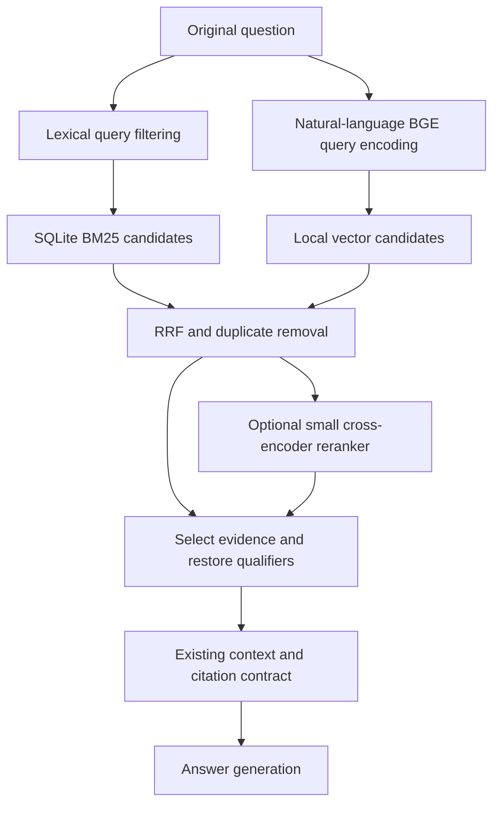

# External change proposal: BGE-small mobile retrieval

**Scope:** Standalone proposal for a possible future change. This document is separate from the current architecture and does not amend its decisions.

**Status:** Original proposal written 2026-09-13; retained as a separate change document. The subsequently authorized desktop implementation now provides independent BM25/BGE switches, hybrid fusion, and a local dense-index builder. See the [implementation and sanity-check guide](../../notebooks/retrieval/HYBRID.md). The design discussion below is historical; reranking, quantization, and mobile validation remain future work.

## Recommendation

Evaluate **SQLite BM25 + `BAAI/bge-small-en-v1.5` embeddings**, combined through reciprocal rank fusion (RRF), as the first mobile retrieval candidate. Keep embeddings-only as a comparison experiment. Add a compact cross-encoder reranker only if its improvement in evidence selection justifies its measured latency, memory, storage, and energy costs.

This is an engineering recommendation, not a measured claim that hybrid search wins on this corpus. The current lexical implementation remains the working system until the experiments establish a better option.

The intended benefit is complementary matching: BM25 helps preserve exact drug names, abbreviations, and terminology, while embeddings may recover relevant passages expressed in different words. Neither method establishes clinical correctness or reliably enforces numeric comparisons and negation.

## What each component does

| Component | Simple explanation | Work performed on the phone |
| --- | --- | --- |
| BM25 | Finds passages containing useful query words | Query the existing local SQLite text index |
| BGE embeddings | Represents meaning as a vector and finds similar passage vectors | Encode the question once and search precomputed vectors |
| Hybrid fusion | Combines the lexical and semantic result lists | Merge ranks and remove duplicate candidates |
| Cross-encoder reranker | Reads the question together with each candidate and scores relevance | Run a separate model on each shortlisted question/passage pair |
| Context preparation | Supplies enough original evidence to answer the question | Resolve source IDs, preserve qualifiers, deduplicate, and apply a budget |

A reranker is a second retrieval stage, not an answer generator. It can reorder retrieved candidates but cannot recover a passage missing from its candidate pool. Sentence Transformers documents this retrieve-then-rerank pattern and its efficiency trade-off. [Retrieve & Re-Rank](https://www.sbert.net/examples/sentence_transformer/applications/retrieve_rerank/README.html)

## Alternatives and trade-offs

| Option | Expected strength | Main limitation | Mobile decision |
| --- | --- | --- | --- |
| BM25 only | Lowest added model cost; useful exact matches | Vocabulary and paraphrase misses; conversational distractions | Retain as baseline and fallback |
| BGE only | Meaning-based matching with one small encoder | May confuse related clinical concepts; can miss decisive exact terms | Required comparison, not the default recommendation |
| BM25 + BGE + RRF | Combines independent ways of finding evidence | More storage and tuning; fusion can also promote irrelevant candidates | Recommended first experiment |
| BM25 + small reranker | Tests whether poor ordering, rather than missing candidates, is the main issue | Cannot recover semantic misses outside BM25's pool | Useful diagnostic comparison |
| Hybrid + small reranker | May improve precision after broad candidate retrieval | Another model and multiple pair evaluations per query | Optional quality tier if phone measurements justify it |
| Hybrid + large reranker | Useful desktop quality reference | Higher deployment and resource burden | Defer as a mobile default |

Do not assume hybrid is automatically superior. If BGE alone matches hybrid quality and reduces total resource use, it can be selected. Conversely, retain BM25 alone if dense retrieval adds little value. Reranking should earn its place through measured improvement at the final context size.

## Selected embedding candidate

| Property | BGE-small-en-v1.5 |
| --- | --- |
| Model ID | `BAAI/bge-small-en-v1.5` |
| Language | English |
| Parameters | Approximately 33.4 million |
| Embedding dimensions | 384 |
| Maximum input sequence | 512 tokens, including special tokens |
| Published model size | Approximately 133 MB |
| License | MIT |
| Retrieval representation | CLS pooling followed by L2 normalization |

The official model card describes the query instruction `Represent this sentence for searching relevant passages: ` for short-query retrieval; passages do not receive this prefix. Use the same pinned tokenizer, pooling, normalization, and model revision during index building and mobile query encoding. [BGE model card](https://huggingface.co/BAAI/bge-small-en-v1.5), [BGE model specifications](https://bge-model.com/tutorial/1_Embedding/1.2.1.html)

This English general-purpose encoder has not been validated here for clinical retrieval, other languages, or the target phones. Its small parameter count makes it a plausible candidate, not a guarantee of acceptable performance.

### Quantization and storage estimates

Evaluate an ONNX INT8 export after establishing a full-precision baseline. ONNX Runtime supports mobile deployment and documents quantization and its possible accuracy effects. Conversion, supported operators, execution provider, and speed must be checked for the actual iOS and Android builds. [ONNX Runtime mobile](https://onnxruntime.ai/docs/tutorials/mobile/), [Quantization documentation](https://onnxruntime.ai/docs/performance/model-optimizations/quantization.html)

Weight-only arithmetic for 33.4M parameters gives approximately 133.6 MB at FP32, 66.8 MB at FP16, and 33.4 MB at INT8. These are illustrative decimal estimates, **not actual exported file sizes or peak RAM measurements**. Some tensors may remain in higher precision; tokenizer files, runtime libraries, activations, and temporary buffers add overhead.

For 10,000 passage vectors, storage arithmetic is:

| Vector format | Calculation | Vector payload only |
| --- | --- | --- |
| FP32 | 10,000 × 384 × 4 bytes | 15.36 MB |
| FP16 | 10,000 × 384 × 2 bytes | 7.68 MB |

The corpus count above is illustrative. Text, ID mappings, SQLite indexes, and manifests require additional storage. Quantizing model weights and quantizing stored vectors are separate decisions; benchmark each separately.

## Proposed offline/mobile split

### Build on a computer

1. Use the verified source passages and existing parent chunk/citation IDs.
2. Create token-bounded embedding units with the necessary section headings, table headers, and qualifiers.
3. Encode those units in batches with the pinned BGE artifact and save normalized vectors.
4. Package vectors, unit-to-parent mappings, original evidence, and the lexical index in a versioned local bundle.
5. Record model/tokenizer revisions, hashes, export and quantization settings, pooling, normalization, query prefix, token limits, and corpus identity.

### Run on the phone

1. Load and verify the compatible model and knowledge bundle.
2. Send a lightly normalized, natural-language question to BGE. Preserve word order, negation, punctuation, age, and weight. Do not feed it the distinct-token, stopword-filtered BM25 query.
3. In the lexical path, use the generic query filtering appropriate to BM25. Preserve the original question for generation and diagnostics.
4. Search local vectors and SQLite; combine their results.
5. Optionally rerank a bounded shortlist, then build context from original source evidence.

Document embeddings are computed once per bundle revision. Only the question needs encoding at query time. A phone must have the compatible local encoder even though document vectors were prepared elsewhere.

The direct fusion-to-context path is the initial candidate. The reranker path is an alternative experiment, not an instruction to include both paths' outputs twice.

## Hybrid design details

Start with these **experimental settings**, then vary them in controlled comparisons:

| Setting | Initial proposal |
| --- | --- |
| Lexical candidates | Top 20 from one lexical result list |
| Dense candidates | Top 20 embedding units, aggregated by parent chunk |
| Fusion | Equal-weight two-list RRF, constant 60 |
| Optional reranker input | Top 10 fused candidates; compare 20 separately |
| Final evidence | Target 3–5 relevant parent groups, subject to completeness and context budget |
| Vector search | Exact dot-product search over normalized vectors first |

Use `RRF(c) = 1 / (60 + lexical_rank(c)) + 1 / (60 + dense_rank(c))`, omitting a term when a candidate is absent from that list. Do not add raw BM25 scores to cosine similarity; their scales and directions differ.

If the existing multi-branch lexical retriever is retained, fuse its branches first and let its final list contribute **one** lexical vote to hybrid fusion. Otherwise the many lexical branches could overwhelm the single dense branch. Deduplicate child units by parent before assigning parent ranks; multiple hits in one long table should not generate repeated fusion votes.

Exact search avoids approximate-index tuning for the first comparison. Introduce an approximate index only if measured corpus size and search time justify its extra storage and recall trade-offs. This proposal does not require a hosted vector database.

A high fusion or cosine score is not a probability that the question is answerable. Calibrate any rejection rule using answerable and out-of-corpus cases; do not invent a universal similarity threshold. Keep low relevance, missing evidence, and technical errors distinguishable.

## Chunking, tables, and evidence integrity

The current character-based chunks may exceed BGE's token limit. Measure with BGE's tokenizer before embedding; never silently truncate a chunk and treat the vector as representing its unseen remainder.

For long text, create smaller embedding units linked to the original parent. For tables, represent a row or small row group together with its column headings, units, title, and applicable footnotes. Preserve original source passages for the answer context; a retrieval representation is not a replacement source.

Store an embedding unit ID, parent chunk ID, source passage IDs, token count, and text hash. Do not mix vectors from different model revisions in one index. Rebuild affected vectors when source text or preprocessing changes. Test the actual offline-produced vector/mobile-query combination after quantization; do not assume cross-runtime equivalence.

Embeddings and reranking may improve which evidence is selected, but they do not guarantee correct table-cell reading, safe numerical reasoning, or preservation of contraindications by the answer model. Those remain separate evaluation concerns.

## Reranker ideas

Begin without a neural reranker to isolate BGE's contribution. If the right evidence regularly appears in the candidate pool but misses the final top five, evaluate a compact cross-encoder next.

`cross-encoder/ms-marco-MiniLM-L6-v2` is a concrete candidate for a desktop comparison. Its published use is query/passage relevance scoring. It is not selected for mobile deployment yet: confirm export compatibility, license, input limits, quantized quality, and resource use before adoption. [Model card](https://huggingface.co/cross-encoder/ms-marco-MiniLM-L6-v2)

Run the reranker on bounded original-text candidates with the question and needed headers together. Truncation at this stage can again hide the decisive qualifier. Do not describe BGE cosine sorting as a cross-encoder reranker: BGE independently encodes text, whereas the cross-encoder jointly evaluates each pair.

For constrained devices, prefer the no-reranker configuration if quality is adequate. Loading embedding, reranking, and generation models simultaneously can increase peak memory. Evaluate unloading or sequential loading as a trade-off against cold-load latency; measure the complete app rather than each model in isolation.

## Experiments and decision criteria

Keep the corpus revision, question set, source mappings, final context budget, generator, and answer prompt fixed across each retrieval comparison. Use existing Q_S1/Q_S2; do not treat two paraphrases of the same topic as independent evidence of generalization.

| Experiment | Purpose |
| --- | --- |
| A: Current BM25/lexical baseline | Establish current retrieval coverage |
| B: BGE only | Measure semantic retrieval contribution |
| C: BM25 + BGE + RRF | Determine whether the two methods complement each other |
| D: BM25 + compact reranker | Separate candidate-ordering issues from semantic recall issues |
| E: Hybrid + compact reranker | Measure the additional precision benefit and device cost |
| F: Best dense-containing option with INT8 encoder | Measure quantization effects independently |

First inspect retrieval outputs without calling the generator. Review which source passages support each benchmark fact; reference answers alone do not provide complete passage-level relevance labels. Record complete evidence coverage for multi-part answers as well as whether any relevant passage appears.

Measure Recall@5/20, MRR@5, final-context relevance, paraphrase consistency, and out-of-corpus behavior. Report topic/category counts and cases involving doses, thresholds, abbreviations, and contraindications. Compare final answer quality only after the retrieval results are understood; count HTTP/API failures separately.

On physical iOS first and Android next, record cold/warm query embedding time, vector-search time, lexical-search time, fusion/reranker time, p50/p95 total retrieval latency, peak process RAM, total bundle size, and repeated-query battery/thermal behavior. Also measure resource use alongside the eventual local generator. Desktop timing is not a phone estimate.

Select hybrid if its evidence coverage or ranking improves enough to justify its added footprint without unacceptable regressions in exact clinical facts. Add reranking only if final-context precision and downstream answers improve further within an agreed device budget. Define that budget from the target device and UX requirements before claiming mobile readiness; no phone measurements or fixed latency guarantee exist yet.

## Relationship to the current failures

The [13 September answer review](../review/review_13092026.md) motivates better evidence selection, but does not prove BGE will solve those failures. Revisit its examples using frozen candidate lists to distinguish missing passages from generation errors despite correct evidence.

Local embeddings remove the need for an embedding API. They do **not** resolve HTTP 429 errors from the separate hosted answer-generation service. Retrieval quality, generator faithfulness, and API reliability must be measured separately.

The next authorized phase here is documentation and discussion. Model downloads, dependency changes, index construction, and experiments remain future implementation work.
